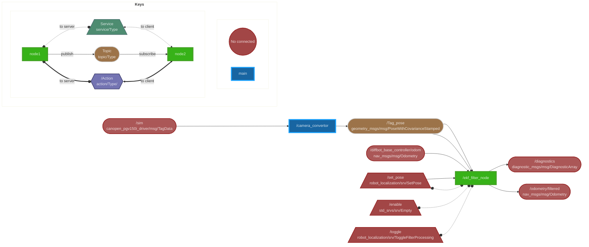

# Localization

This package implements a EKF fliter for eirabot. It has a launch file for gazebo sim and physical robot implementation. This package also contains a file for converting TagData to a pose with covariance for the demo area downstairs based on the vertex locations in sample.xml

## EKF 

### What it does

The EKF fliter performs sensor fusion between the odometry data of the controller (motor encoders) and the tag readings to get a more accurate estimation of the robots location. The EKF implments the transform from odom to base_link with odom frame being based at 0,0. The EKF fuses the odometry data from motor and the pose data got from tag reading.

>:shit: Found Out this is bad practice and two seperate EKF should be used with one for fusing continuous position data and another for fusing global absolute position data

## Running localization

To add the EKF fliter nodes to a launch file add the following node to the file in as a launch description action

```python
robot_localization_file_path = PathJoinSubstitution([FindPackageShare(package_name), 'config/ekf.yaml']) 

start_robot_localization_cmd = Node(
    package='robot_localization',
    executable='ekf_node',
    name='ekf_filter_node',
    output='screen',
    parameters=[robot_localization_file_path])


```

To launch the ekf fliter and tagData to pose in terminal use the following commands

### on physical robot

```bash
ros2 launch localization localization.launch.py 
```

### in sim

```bash
ros2 launch localization localization_sim.launch.py
```

## Diagram



## To Do

- Make a second EKF so one for continuous position data and another for using global absolute position data
- Allow the EKF to take in IMU data
- Adjust the covariance matrices
- Allow tagData_to_pose node to take in different xml files
